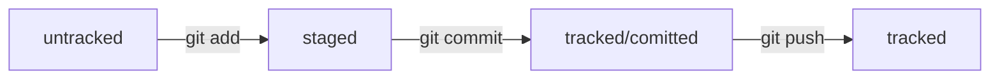

Действие | Команда 
--- | ---
Инициализируем | git init
Добавляем к контролю | git add README.md
Добавляем комментарий | git commit -m "first commit"
Выбор ветки | git branch -M main
Соединяем локальный с облачным | git remote add origin git@github.com
Пушим в облако | git push -u origin main

* --amend рассчитан на работу с последним коммитом (HEAD).
* Дополнить коммит новыми файлами можно с помощью git commit --amend --no-edit. Благодаря опции --no-edit сообщение к коммиту останется таким, каким и было.
* Изменить сообщение к коммиту позволяет команда git commit --amend -m "Обновлённое сообщение коммита".
